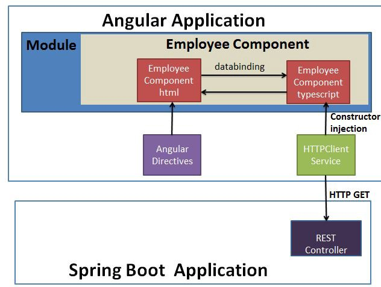

- SpringBoot study https://www.youtube.com/watch?v=Gx4iBLKLVHk
  ► Project Source Code:
- Back-end: https://github.com/getarrays/employeemanager
- Front-end: https://github.com/getarrays/employeemanagerapp

##Angular Study
1. Install nodejs
2. Install angular cli `npm install -g @angular/cli`
3. Create new project `ng new <project name>`
!
   
